  <body>
    <h1 align="center">AiSketcher</h1>
      
Fei Gao,&nbsp;Jingjie Zhu,&nbsp;Zeyuan Yu,&nbsp;Peng Li,&nbsp;Tao Wang,&nbsp;Senior Member,&nbsp;IEEE

          <h3 align="center">AiStecher's Generating Results of robot drawing</h3>
       
The results are shown as follows, where each of the three lines is the original image, the generated image and the image of robot drawing.Other results can be shown in the link below:

    <td halign="center" style="word-wrap: break-word;" valign="top">
      

        <a href="ours_g1.html">Results with Preprocessing</a> 
      

    </td>
     <td halign="center" style="word-wrap: break-word;" valign="top">
      

        <a href="ours_g2.html">Results without Preprocessing</a> 
      

    </td>
       <td halign="center" style="word-wrap: break-word;" valign="top">
      

        <a href="ours_g3.html">Results with different styles</a> 
      

    </td>
     <table style="table-layout: fixed;" align="center">
      <tr align="center">
        <td halign="center" style="word-wrap: break-word;" valign="top">
          

             
          

        </td>
    <td halign="center" style="word-wrap: break-word;" valign="top">
      

         
      

    </td>
     <td halign="center" style="word-wrap: break-word;" valign="top">
      

         
      

    </td>
    <td halign="center" style="word-wrap: break-word;" valign="top">
      

        <a href="images/ours_robot/44_yuan.jpg">
          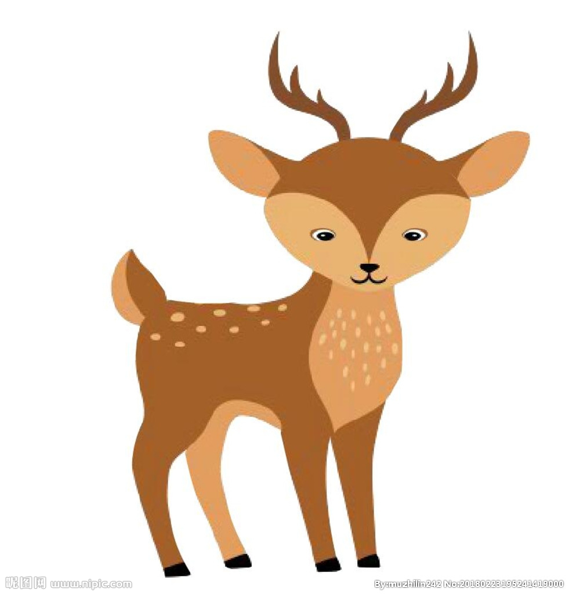
        </a> 
      

    </td>
      <td halign="center" style="word-wrap: break-word;" valign="top">
      

         
      

    </td>
  </tr>
      <tr align="center">
        <td halign="center" style="word-wrap: break-word;" valign="top">
          

            <a href="images/ours_robot/41_generate.jpg">
              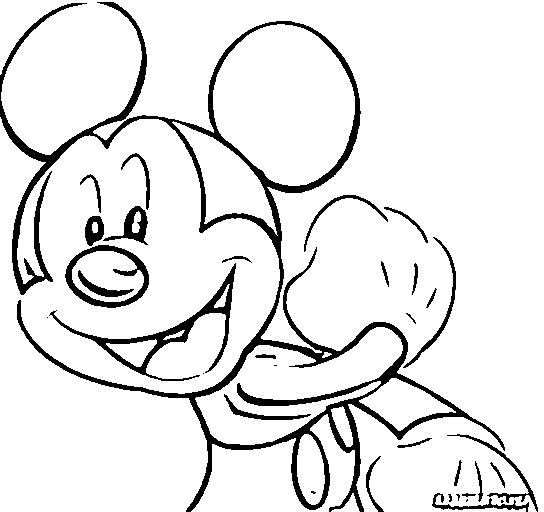
            </a> 
          

        </td>
    <td halign="center" style="word-wrap: break-word;" valign="top">
      

        <a href="images/ours_robot/42_generate.jpg">
          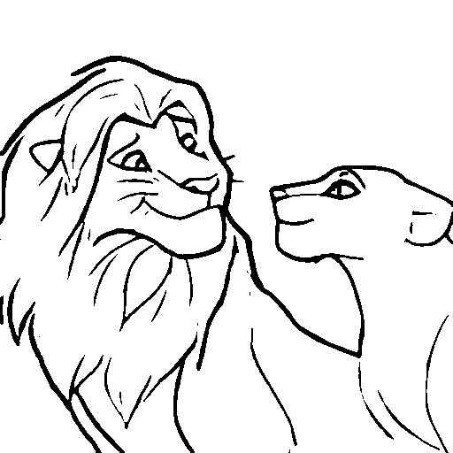
        </a> 
      

    </td>
     <td halign="center" style="word-wrap: break-word;" valign="top">
      

         
      

    </td>
    <td halign="center" style="word-wrap: break-word;" valign="top">
      

        <a href="images/ours_robot/44_generate.jpg">
          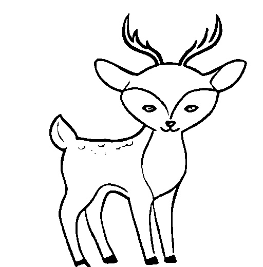
        </a> 
      

    </td>
      <td halign="center" style="word-wrap: break-word;" valign="top">
      

         
      

    </td></tr>
      <tr>
        <td halign="center" style="word-wrap: break-word;" valign="top">
          

            <a href="images/ours_robot/41.jpg">
              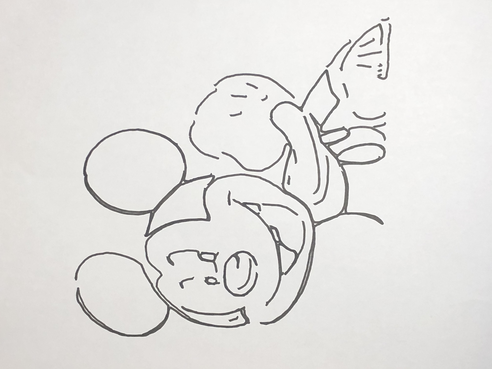
            </a> 
          

        </td>
    <td halign="center" style="word-wrap: break-word;" valign="top">
      

        <a href="images/ours_robot/42.jpg">
          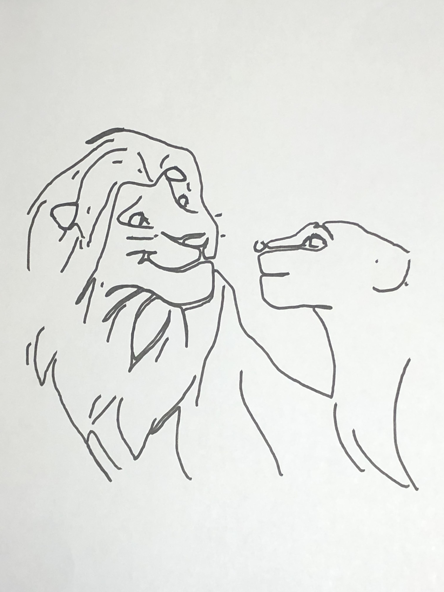
        </a> 
      

    </td>
     <td halign="center" style="word-wrap: break-word;" valign="top">
      

        <a href="images/ours_robot/43.jpg">
          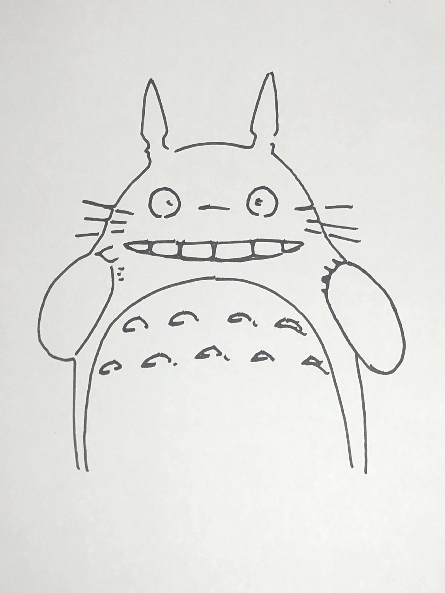
        </a> 
      

    </td>
    <td halign="center" style="word-wrap: break-word;" valign="top">
      

        <a href="images/ours_robot/44.jpg">
          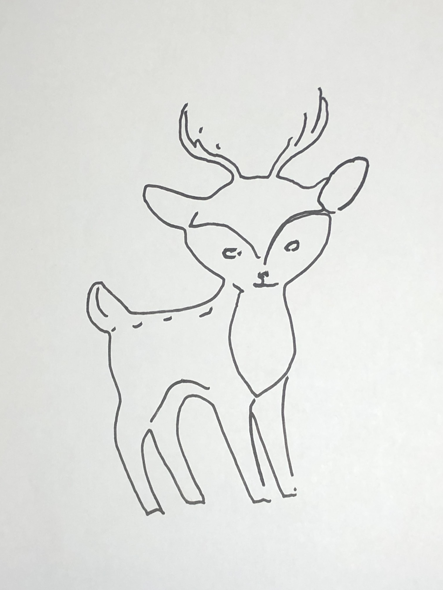
        </a> 
      

    </td>
      <td halign="center" style="word-wrap: break-word;" valign="top">
      

        <a href="images/ours_robot/47.jpg">
          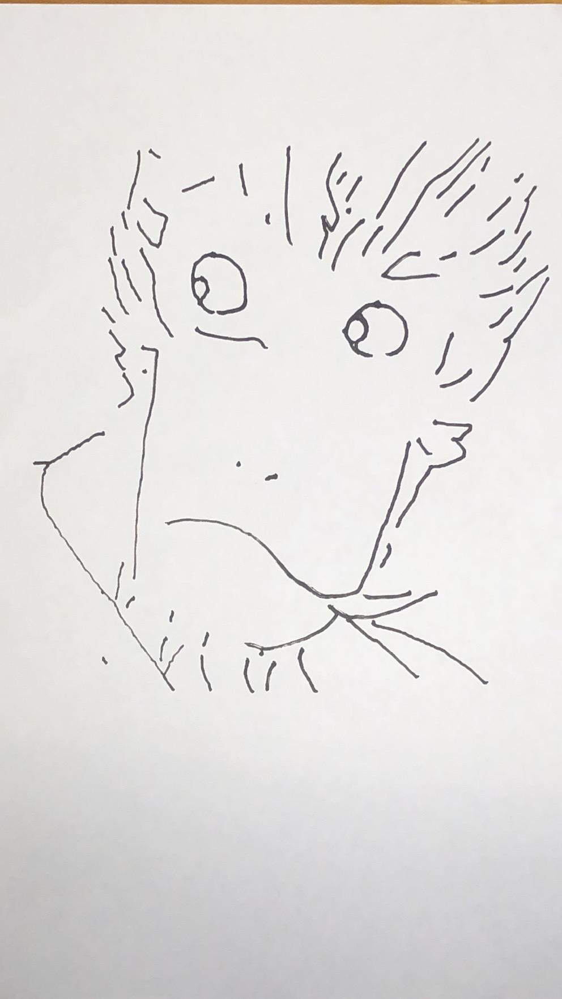
        </a> 
      

    </td>
  </tr>
      <tr align="center">
        <td halign="center" style="word-wrap: break-word;" valign="top">
          

             
          

        </td>
    <td halign="center" style="word-wrap: break-word;" valign="top">
      

         
      

    </td>
     <td halign="center" style="word-wrap: break-word;" valign="top">
      

         
      

    </td>
    <td halign="center" style="word-wrap: break-word;" valign="top">
      

         
      

    </td>
      <td halign="center" style="word-wrap: break-word;" valign="top">
      

         
      

    </td>
  </tr>
  <tr align="center">
    <td halign="center" style="word-wrap: break-word;" valign="top">
      

         
      

    </td>
<td halign="center" style="word-wrap: break-word;" valign="top">
  

     
  

</td>
 <td halign="center" style="word-wrap: break-word;" valign="top">
  

    <a href="images/ours_robot/34_generate.jpeg">
      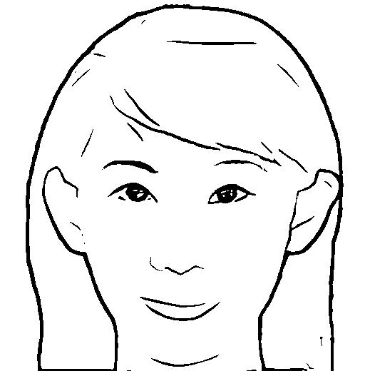
    </a> 
  

</td>
<td halign="center" style="word-wrap: break-word;" valign="top">
  

     
  

</td>
  <td halign="center" style="word-wrap: break-word;" valign="top">
  

    <a href="images/ours_robot/32_generate.jpg">
      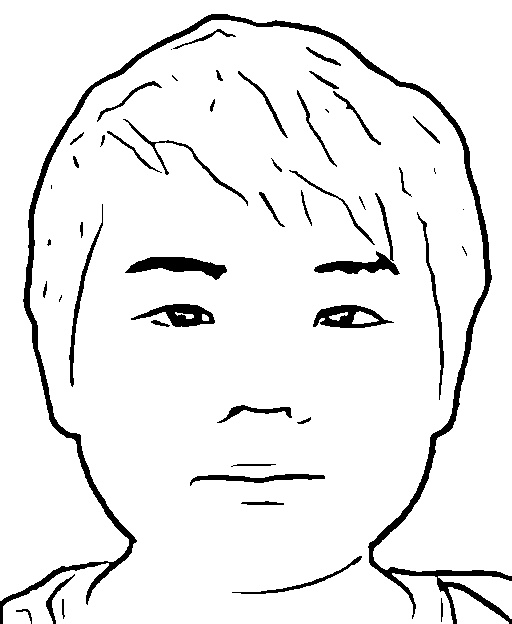
    </a> 
  

</td>
      <tr align="center">
        <td halign="center" style="word-wrap: break-word;" valign="top">
          

             
          

        </td>
    <td halign="center" style="word-wrap: break-word;" valign="top">
      

        <a href="images/ours_robot/35.jpg">
          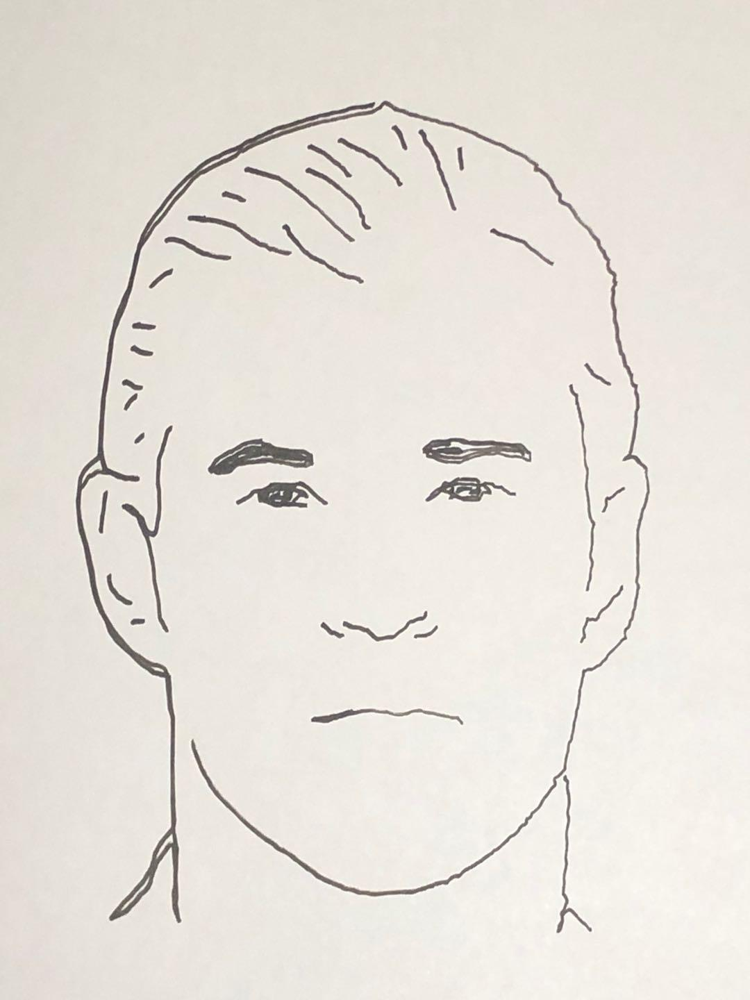
        </a> 
      

    </td>
     <td halign="center" style="word-wrap: break-word;" valign="top">
      

         
      

    </td>
    <td halign="center" style="word-wrap: break-word;" valign="top">
      

         
      

    </td>
      <td halign="center" style="word-wrap: break-word;" valign="top">
      

         
      

    </td>
  </tr>
      <tr align="center">
        <td halign="center" style="word-wrap: break-word;" valign="top">
          

             
          

        </td>
    <td halign="center" style="word-wrap: break-word;" valign="top">
      

         
      

    </td>
     <td halign="center" style="word-wrap: break-word;" valign="top">
      

         
      

    </td>
    <td halign="center" style="word-wrap: break-word;" valign="top">
      

         
      

    </td>
      <td halign="center" style="word-wrap: break-word;" valign="top">
      

         
      

    </td>
  </tr>
  <tr align="center">
    <td halign="center" style="word-wrap: break-word;" valign="top">
      

         
      

    </td>
<td halign="center" style="word-wrap: break-word;" valign="top">
  

     
  

</td>
 <td halign="center" style="word-wrap: break-word;" valign="top">
  

    <a href="images/ours_robot/28_generate.jpeg">
      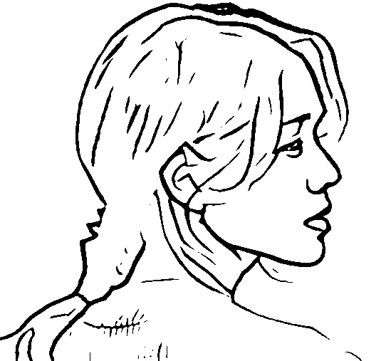
    </a> 
  

</td>
<td halign="center" style="word-wrap: break-word;" valign="top">
  

     
  

</td>
  <td halign="center" style="word-wrap: break-word;" valign="top">
  

     
  

</td>
      <tr align="center">
        <td halign="center" style="word-wrap: break-word;" valign="top">
          

             
          

        </td>
    <td halign="center" style="word-wrap: break-word;" valign="top">
      

         
      

    </td>
     <td halign="center" style="word-wrap: break-word;" valign="top">
      

         
      

    </td>
    <td halign="center" style="word-wrap: break-word;" valign="top">
      

         
      

    </td>
      <td halign="center" style="word-wrap: break-word;" valign="top">
      

         
      

    </td>
  </tr>
      <tr align="center">
        <td halign="center" style="word-wrap: break-word;" valign="top">
          

             
          

        </td>
    <td halign="center" style="word-wrap: break-word;" valign="top">
      

         
      

    </td>
     <td halign="center" style="word-wrap: break-word;" valign="top">
      

         
      

    </td>
    <td halign="center" style="word-wrap: break-word;" valign="top">
      

         
      

    </td>
      <td halign="center" style="word-wrap: break-word;" valign="top">
      

         
      

    </td>
  </tr>
  <tr align="center">
    <td halign="center" style="word-wrap: break-word;" valign="top">
      

        <a href="images/ours_robot/20_generate.jpg">
          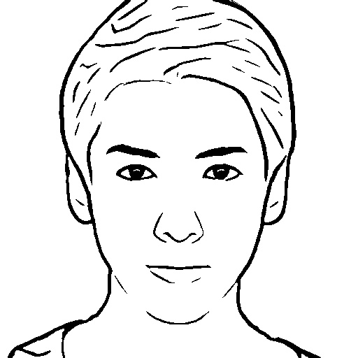
        </a> 
      

    </td>
<td halign="center" style="word-wrap: break-word;" valign="top">
  

     
  

</td>
 <td halign="center" style="word-wrap: break-word;" valign="top">
  

    <a href="images/ours_robot/11_generate.jpeg">
      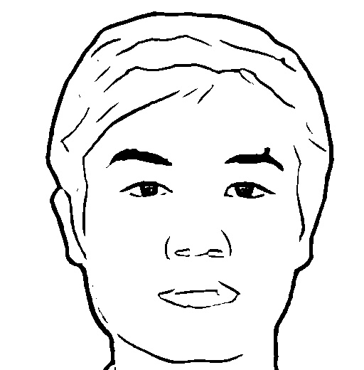
    </a> 
  

</td>
<td halign="center" style="word-wrap: break-word;" valign="top">
  

     
  

</td>
  <td halign="center" style="word-wrap: break-word;" valign="top">
  

     
  

</td>
      <tr align="center">
        <td halign="center" style="word-wrap: break-word;" valign="top">
          

             
          

        </td>
    <td halign="center" style="word-wrap: break-word;" valign="top">
      

         
      

    </td>
     <td halign="center" style="word-wrap: break-word;" valign="top">
      

         
      

    </td>
    <td halign="center" style="word-wrap: break-word;" valign="top">
      

         
      

    </td>
      <td halign="center" style="word-wrap: break-word;" valign="top">
      

         
      

    </td>
  </tr>
      <tr align="center">
        <td halign="center" style="word-wrap: break-word;" valign="top">
          

             
          

        </td>
    <td halign="center" style="word-wrap: break-word;" valign="top">
      

         
      

    </td>
     <td halign="center" style="word-wrap: break-word;" valign="top">
      

         
      

    </td>
    <td halign="center" style="word-wrap: break-word;" valign="top">
      

         
      

    </td>
      <td halign="center" style="word-wrap: break-word;" valign="top">
      

         
      

    </td>
  </tr>
  <tr align="center">
    <td halign="center" style="word-wrap: break-word;" valign="top">
      

         
      

    </td>
<td halign="center" style="word-wrap: break-word;" valign="top">
  

     
  

</td>
 <td halign="center" style="word-wrap: break-word;" valign="top">
  

     
  

</td>
<td halign="center" style="word-wrap: break-word;" valign="top">
  

     
  

</td>
  <td halign="center" style="word-wrap: break-word;" valign="top">
  

     
  

</td>
      <tr align="center">
        <td halign="center" style="word-wrap: break-word;" valign="top">
          

            <a href="images/ours_robot/45.jpg">
              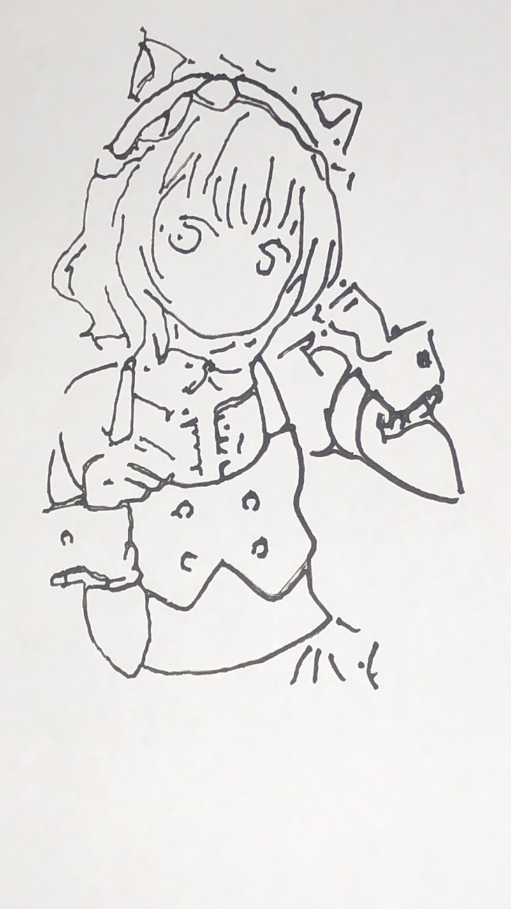
            </a> 
          

        </td>
    <td halign="center" style="word-wrap: break-word;" valign="top">
      

         
      

    </td>
     <td halign="center" style="word-wrap: break-word;" valign="top">
      

         
      

    </td>
    <td halign="center" style="word-wrap: break-word;" valign="top">
      

         
      

    </td>
      <td halign="center" style="word-wrap: break-word;" valign="top">
      

         
      

    </td>
  </tr> 
      <tr align="center">
        <td halign="center" style="word-wrap: break-word;" valign="top">
          

             
          

        </td>
    <td halign="center" style="word-wrap: break-word;" valign="top">
      

         
      

    </td>
     <td halign="center" style="word-wrap: break-word;" valign="top">
      

         
      

    </td>
    <td halign="center" style="word-wrap: break-word;" valign="top">
      

         
      

    </td>
      <td halign="center" style="word-wrap: break-word;" valign="top">
      

         
      

    </td>
  </tr>
  <tr align="center">
    <td halign="center" style="word-wrap: break-word;" valign="top">
      

         
      

    </td>
<td halign="center" style="word-wrap: break-word;" valign="top">
  

     
  

</td>
 <td halign="center" style="word-wrap: break-word;" valign="top">
  

    <a href="images/ours_robot/3_generate.jpeg">
      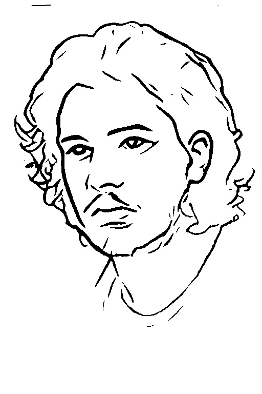
    </a> 
  

</td>
<td halign="center" style="word-wrap: break-word;" valign="top">
  

     
  

</td>
  <td halign="center" style="word-wrap: break-word;" valign="top">
  

     
  

</td>
      <tr align="center">
        <td halign="center" style="word-wrap: break-word;" valign="top">
          

             
          

        </td>
    <td halign="center" style="word-wrap: break-word;" valign="top">
      

         
      

    </td>
     <td halign="center" style="word-wrap: break-word;" valign="top">
      

         
      

    </td>
    <td halign="center" style="word-wrap: break-word;" valign="top">
      

         
      

    </td>
      <td halign="center" style="word-wrap: break-word;" valign="top">
      

         
      

    </td>
  </tr>
      <tr align="center">
        <td halign="center" style="word-wrap: break-word;" valign="top">
          

             
          

        </td>
    <td halign="center" style="word-wrap: break-word;" valign="top">
      

         
      

    </td>
     <td halign="center" style="word-wrap: break-word;" valign="top">
      

         
      

    </td>
    <td halign="center" style="word-wrap: break-word;" valign="top">
      

         
      

    </td>
      <td halign="center" style="word-wrap: break-word;" valign="top">
      

         
      

    </td>
  </tr>
  <tr align="center">
    <td halign="center" style="word-wrap: break-word;" valign="top">
      

        <a href="images/ours_robot/9_generate.jpg">
          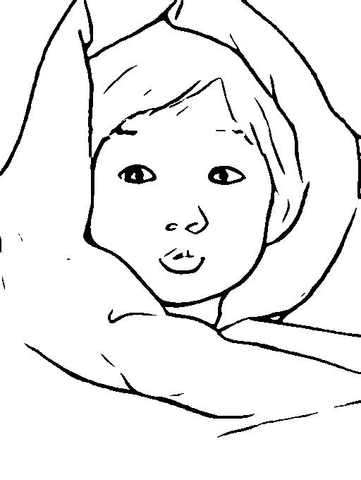
        </a> 
      

    </td>
<td halign="center" style="word-wrap: break-word;" valign="top">
  

    <a href="images/ours_robot/26_generate.jpg">
      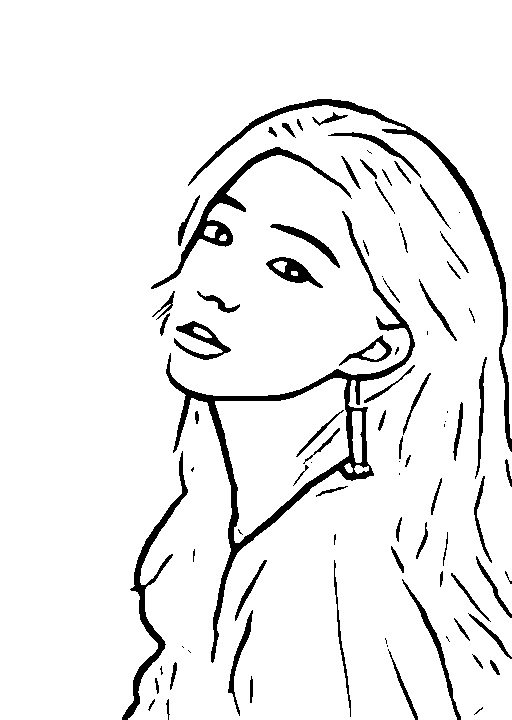
    </a> 
  

</td>
 <td halign="center" style="word-wrap: break-word;" valign="top">
  

     
  

</td>
<td halign="center" style="word-wrap: break-word;" valign="top">
  

     
  

</td>
  <td halign="center" style="word-wrap: break-word;" valign="top">
  

     
  

</td>
      <tr align="center">
        <td halign="center" style="word-wrap: break-word;" valign="top">
          

             
          

        </td>
    <td halign="center" style="word-wrap: break-word;" valign="top">
      

        <a href="images/ours_robot/26.jpg">
          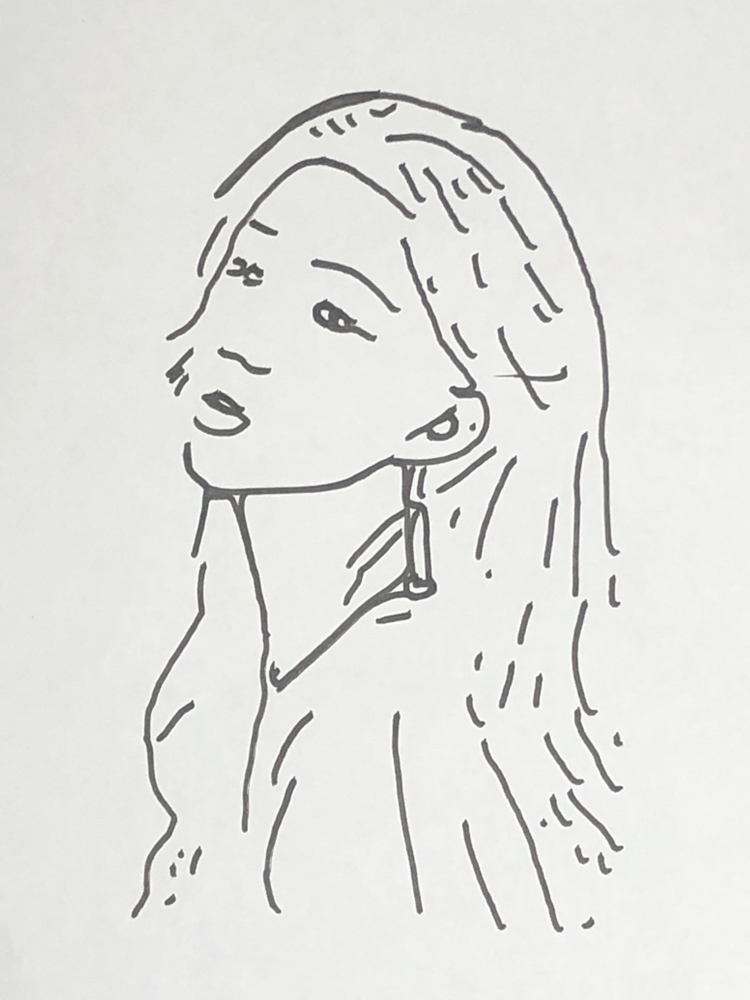
        </a> 
      

    </td>
     <td halign="center" style="word-wrap: break-word;" valign="top">
      

         
      

    </td>
    <td halign="center" style="word-wrap: break-word;" valign="top">
      

         
      

    </td>
      <td halign="center" style="word-wrap: break-word;" valign="top">
      

         
      

    </td>
  </tr>
</table> 
 
Other results can be shown in the link below:

    <td halign="center" style="word-wrap: break-word;" valign="top">
      

        <a href="ours_g1.html">Results with Preprocessing</a> 
      

    </td>
     <td halign="center" style="word-wrap: break-word;" valign="top">
      

        <a href="ours_g2.html">Results without Preprocessing</a> 
      

    </td>
       <td halign="center" style="word-wrap: break-word;" valign="top">
      

        <a href="ours_g3.html">Results with different styles</a> 
      

    </td>
  
 
