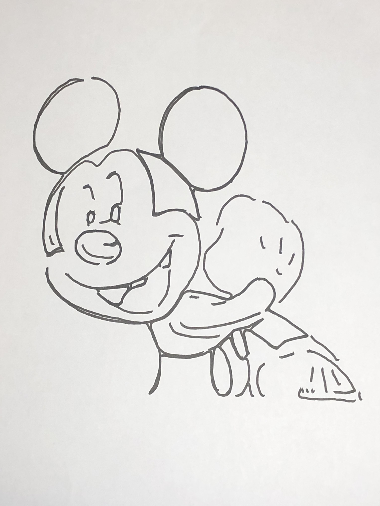

  <body>
    <h1 align="center">AiSketcher</h1>
      
Fei Gao,&nbsp;Jingjie Zhu,&nbsp;Zeyuan Yu,&nbsp;Peng Li,&nbsp;Tao Wang,&nbsp;Senior Member,&nbsp;IEEE

          <h3 align="center">AiStecher's Generating Results of robot drawing</h3>
       
The results are shown as follows, where each of the three lines is the original image, the generated image and the image of robot drawing.Other results can be shown in the link below:

    <td halign="center" style="word-wrap: break-word;" valign="top">
      

        <a href="ours_g1.html">Results with Preprocessing</a> 
      

    </td>
     <td halign="center" style="word-wrap: break-word;" valign="top">
      

        <a href="ours_g2.html">Results without Preprocessing</a> 
      

    </td>
       <td halign="center" style="word-wrap: break-word;" valign="top">
      

        <a href="ours_g3.html">Results with different styles</a> 
      

    </td>
     <table style="table-layout: fixed;" align="center">
      <tr align="center">
        <td halign="center" style="word-wrap: break-word;" valign="top">
          

             
          

        </td>
    <td halign="center" style="word-wrap: break-word;" valign="top">
      

         
      

    </td>
     <td halign="center" style="word-wrap: break-word;" valign="top">
      

         
      

    </td>
    <td halign="center" style="word-wrap: break-word;" valign="top">
      

         
      

    </td>
      <td halign="center" style="word-wrap: break-word;" valign="top">
      

         
      

    </td>
  </tr>
      <tr align="center">
        <td halign="center" style="word-wrap: break-word;" valign="top">
          

             
          

        </td>
    <td halign="center" style="word-wrap: break-word;" valign="top">
      

         
      

    </td>
     <td halign="center" style="word-wrap: break-word;" valign="top">
      

         
      

    </td>
    <td halign="center" style="word-wrap: break-word;" valign="top">
      

         
      

    </td>
      <td halign="center" style="word-wrap: break-word;" valign="top">
      

         
      

    </td></tr>
      <tr>
        <td halign="center" style="word-wrap: break-word;" valign="top">
          

             
          

        </td>
    <td halign="center" style="word-wrap: break-word;" valign="top">
      

         
      

    </td>
     <td halign="center" style="word-wrap: break-word;" valign="top">
      

         
      

    </td>
    <td halign="center" style="word-wrap: break-word;" valign="top">
      

         
      

    </td>
      <td halign="center" style="word-wrap: break-word;" valign="top">
      

         
      

    </td>
  </tr>
      <tr align="center">
        <td halign="center" style="word-wrap: break-word;" valign="top">
          

             
          

        </td>
    <td halign="center" style="word-wrap: break-word;" valign="top">
      

         
      

    </td>
     <td halign="center" style="word-wrap: break-word;" valign="top">
      

         
      

    </td>
    <td halign="center" style="word-wrap: break-word;" valign="top">
      

         
      

    </td>
      <td halign="center" style="word-wrap: break-word;" valign="top">
      

         
      

    </td>
  </tr>
  <tr align="center">
    <td halign="center" style="word-wrap: break-word;" valign="top">
      

         
      

    </td>
<td halign="center" style="word-wrap: break-word;" valign="top">
  

     
  

</td>
 <td halign="center" style="word-wrap: break-word;" valign="top">
  

     
  

</td>
<td halign="center" style="word-wrap: break-word;" valign="top">
  

     
  

</td>
  <td halign="center" style="word-wrap: break-word;" valign="top">
  

     
  

</td>
      <tr align="center">
        <td halign="center" style="word-wrap: break-word;" valign="top">
          

             
          

        </td>
    <td halign="center" style="word-wrap: break-word;" valign="top">
      

         
      

    </td>
     <td halign="center" style="word-wrap: break-word;" valign="top">
      

         
      

    </td>
    <td halign="center" style="word-wrap: break-word;" valign="top">
      

         
      

    </td>
      <td halign="center" style="word-wrap: break-word;" valign="top">
      

         
      

    </td>
  </tr>
      <tr align="center">
        <td halign="center" style="word-wrap: break-word;" valign="top">
          

             
          

        </td>
    <td halign="center" style="word-wrap: break-word;" valign="top">
      

         
      

    </td>
     <td halign="center" style="word-wrap: break-word;" valign="top">
      

         
      

    </td>
    <td halign="center" style="word-wrap: break-word;" valign="top">
      

         
      

    </td>
      <td halign="center" style="word-wrap: break-word;" valign="top">
      

         
      

    </td>
  </tr>
  <tr align="center">
    <td halign="center" style="word-wrap: break-word;" valign="top">
      

         
      

    </td>
<td halign="center" style="word-wrap: break-word;" valign="top">
  

     
  

</td>
 <td halign="center" style="word-wrap: break-word;" valign="top">
  

     
  

</td>
<td halign="center" style="word-wrap: break-word;" valign="top">
  

     
  

</td>
  <td halign="center" style="word-wrap: break-word;" valign="top">
  

     
  

</td>
      <tr align="center">
        <td halign="center" style="word-wrap: break-word;" valign="top">
          

             
          

        </td>
    <td halign="center" style="word-wrap: break-word;" valign="top">
      

         
      

    </td>
     <td halign="center" style="word-wrap: break-word;" valign="top">
      

         
      

    </td>
    <td halign="center" style="word-wrap: break-word;" valign="top">
      

         
      

    </td>
      <td halign="center" style="word-wrap: break-word;" valign="top">
      

         
      

    </td>
  </tr>
      <tr align="center">
        <td halign="center" style="word-wrap: break-word;" valign="top">
          

             
          

        </td>
    <td halign="center" style="word-wrap: break-word;" valign="top">
      

         
      

    </td>
     <td halign="center" style="word-wrap: break-word;" valign="top">
      

         
      

    </td>
    <td halign="center" style="word-wrap: break-word;" valign="top">
      

         
      

    </td>
      <td halign="center" style="word-wrap: break-word;" valign="top">
      

         
      

    </td>
  </tr>
  <tr align="center">
    <td halign="center" style="word-wrap: break-word;" valign="top">
      

         
      

    </td>
<td halign="center" style="word-wrap: break-word;" valign="top">
  

     
  

</td>
 <td halign="center" style="word-wrap: break-word;" valign="top">
  

     
  

</td>
<td halign="center" style="word-wrap: break-word;" valign="top">
  

     
  

</td>
  <td halign="center" style="word-wrap: break-word;" valign="top">
  

     
  

</td>
      <tr align="center">
        <td halign="center" style="word-wrap: break-word;" valign="top">
          

             
          

        </td>
    <td halign="center" style="word-wrap: break-word;" valign="top">
      

         
      

    </td>
     <td halign="center" style="word-wrap: break-word;" valign="top">
      

         
      

    </td>
    <td halign="center" style="word-wrap: break-word;" valign="top">
      

         
      

    </td>
      <td halign="center" style="word-wrap: break-word;" valign="top">
      

         
      

    </td>
  </tr>
      <tr align="center">
        <td halign="center" style="word-wrap: break-word;" valign="top">
          

             
          

        </td>
    <td halign="center" style="word-wrap: break-word;" valign="top">
      

         
      

    </td>
     <td halign="center" style="word-wrap: break-word;" valign="top">
      

         
      

    </td>
    <td halign="center" style="word-wrap: break-word;" valign="top">
      

         
      

    </td>
      <td halign="center" style="word-wrap: break-word;" valign="top">
      

         
      

    </td>
  </tr>
  <tr align="center">
    <td halign="center" style="word-wrap: break-word;" valign="top">
      

         
      

    </td>
<td halign="center" style="word-wrap: break-word;" valign="top">
  

     
  

</td>
 <td halign="center" style="word-wrap: break-word;" valign="top">
  

     
  

</td>
<td halign="center" style="word-wrap: break-word;" valign="top">
  

     
  

</td>
  <td halign="center" style="word-wrap: break-word;" valign="top">
  

     
  

</td>
      <tr align="center">
        <td halign="center" style="word-wrap: break-word;" valign="top">
          

             
          

        </td>
    <td halign="center" style="word-wrap: break-word;" valign="top">
      

         
      

    </td>
     <td halign="center" style="word-wrap: break-word;" valign="top">
      

         
      

    </td>
    <td halign="center" style="word-wrap: break-word;" valign="top">
      

         
      

    </td>
      <td halign="center" style="word-wrap: break-word;" valign="top">
      

         
      

    </td>
  </tr> 
      <tr align="center">
        <td halign="center" style="word-wrap: break-word;" valign="top">
          

             
          

        </td>
    <td halign="center" style="word-wrap: break-word;" valign="top">
      

         
      

    </td>
     <td halign="center" style="word-wrap: break-word;" valign="top">
      

         
      

    </td>
    <td halign="center" style="word-wrap: break-word;" valign="top">
      

         
      

    </td>
      <td halign="center" style="word-wrap: break-word;" valign="top">
      

         
      

    </td>
  </tr>
  <tr align="center">
    <td halign="center" style="word-wrap: break-word;" valign="top">
      

         
      

    </td>
<td halign="center" style="word-wrap: break-word;" valign="top">
  

     
  

</td>
 <td halign="center" style="word-wrap: break-word;" valign="top">
  

     
  

</td>
<td halign="center" style="word-wrap: break-word;" valign="top">
  

     
  

</td>
  <td halign="center" style="word-wrap: break-word;" valign="top">
  

     
  

</td>
      <tr align="center">
        <td halign="center" style="word-wrap: break-word;" valign="top">
          

             
          

        </td>
    <td halign="center" style="word-wrap: break-word;" valign="top">
      

         
      

    </td>
     <td halign="center" style="word-wrap: break-word;" valign="top">
      

         
      

    </td>
    <td halign="center" style="word-wrap: break-word;" valign="top">
      

         
      

    </td>
      <td halign="center" style="word-wrap: break-word;" valign="top">
      

         
      

    </td>
  </tr>
      <tr align="center">
        <td halign="center" style="word-wrap: break-word;" valign="top">
          

             
          

        </td>
    <td halign="center" style="word-wrap: break-word;" valign="top">
      

         
      

    </td>
     <td halign="center" style="word-wrap: break-word;" valign="top">
      

         
      

    </td>
    <td halign="center" style="word-wrap: break-word;" valign="top">
      

         
      

    </td>
      <td halign="center" style="word-wrap: break-word;" valign="top">
      

         
      

    </td>
  </tr>
  <tr align="center">
    <td halign="center" style="word-wrap: break-word;" valign="top">
      

         
      

    </td>
<td halign="center" style="word-wrap: break-word;" valign="top">
  

     
  

</td>
 <td halign="center" style="word-wrap: break-word;" valign="top">
  

     
  

</td>
<td halign="center" style="word-wrap: break-word;" valign="top">
  

     
  

</td>
  <td halign="center" style="word-wrap: break-word;" valign="top">
  

     
  

</td>
      <tr align="center">
        <td halign="center" style="word-wrap: break-word;" valign="top">
          

             
          

        </td>
    <td halign="center" style="word-wrap: break-word;" valign="top">
      

         
      

    </td>
     <td halign="center" style="word-wrap: break-word;" valign="top">
      

         
      

    </td>
    <td halign="center" style="word-wrap: break-word;" valign="top">
      

         
      

    </td>
      <td halign="center" style="word-wrap: break-word;" valign="top">
      

         
      

    </td>
  </tr>
</table> 
 
Other results can be shown in the link below:

    <td halign="center" style="word-wrap: break-word;" valign="top">
      

        <a href="ours_g1.html">Results with Preprocessing</a> 
      

    </td>
     <td halign="center" style="word-wrap: break-word;" valign="top">
      

        <a href="ours_g2.html">Results without Preprocessing</a> 
      

    </td>
       <td halign="center" style="word-wrap: break-word;" valign="top">
      

        <a href="ours_g3.html">Results with different styles</a> 
      

    </td>
  
 
